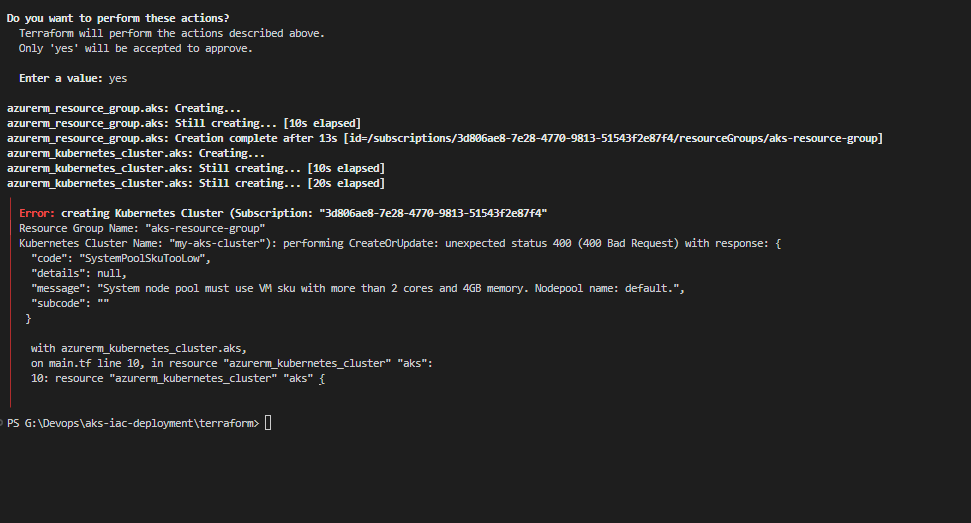
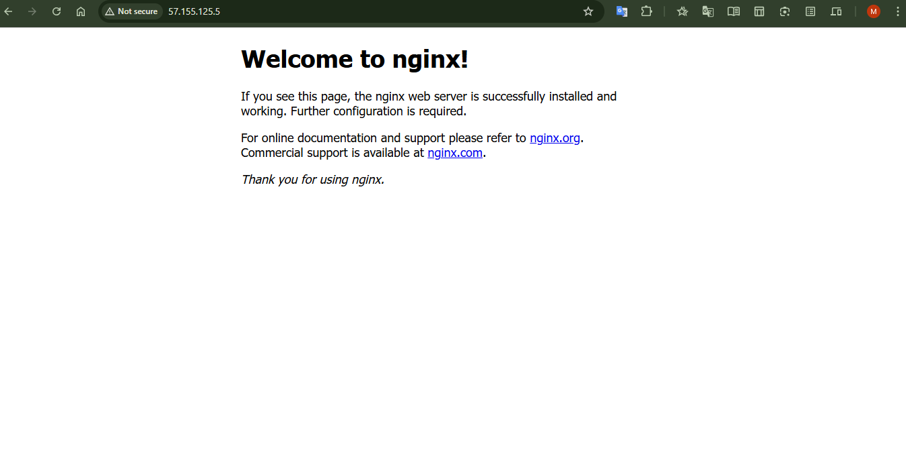

***`Hey there! 👋 My Kubernetes cluster 🐳 is up and running with the nginx web server. Want to see it in action? Swing by 👉*** [live](http://57.155.125.5/) ***it’s live and waiting for you! 🚀***


## Introduction 🌟

Welcome to my AKS IaC and Deployment Task! This project is all about diving into the world of **Azure Kubernetes Service (AKS)** and **Infrastructure as Code (IaC)** to build a cloud-based Kubernetes cluster and deploy a simple application. Whether you're a DevOps newbie or just curious about cloud tech, this guide will walk you through the process step by step—so you can replicate it yourself!

### 🎯 Purpose of This Task

This assignment is designed to simulate a real-world DevOps scenario. The goal? Use **Terraform** to create an AKS cluster on Azure, deploy a small app (like nginx), and document everything clearly. It’s a hands-on way to:

- Learn how to define and manage cloud infrastructure with code (IaC).
- Get comfortable with Kubernetes by deploying and exposing an application.
- Practice a typical DevOps workflow, from setup to deployment.

### ❓ Why Are We Doing This?

In today’s cloud-driven world, automating infrastructure and managing containerized apps are must-have skills. This task mimics what DevOps engineers do daily—setting up scalable, reliable systems efficiently. Plus, it’s a fantastic learning opportunity to bridge the gap between theory and practice!

### ✨ Benefits of Completing This

By tackling this assignment, I’ve gained (and you can too!):

- **Practical Skills**: Hands-on experience with Terraform, AKS, and Kubernetes.
- **Problem-Solving**: The ability to troubleshoot issues like misconfigured resources or deployment errors.
- **Confidence**: A solid understanding of how cloud and containers work together.
- **Documentation Prowess**: The knack for explaining technical steps in a clear, friendly way.

### 🚀 What Else Can You Do With This?

This setup is just the beginning! With an AKS cluster up and running, you could:

- Deploy more complex apps (think microservices or a web app with a database).
- Add CI/CD pipelines using GitHub Actions or Azure DevOps.
- Experiment with scaling, monitoring, or security features in Kubernetes.

### 🛠️ Key Concepts and Technologies

To rock this task, you’ll need to know a bit about:

- **Infrastructure as Code (IaC)**: Defining cloud resources with Terraform.
- **Azure Kubernetes Service (AKS)**: Azure’s managed Kubernetes platform.
- **Kubernetes**: The open-source system for orchestrating containers.
- **Docker**: The tech that packages apps into containers.
- **Git**: For version control and sharing your work.

---

# Cloning and Testing the Repository 🧪

Ready to move to the next step? Let’s get hands-on by cloning the repository and testing the setup on your own machine. Follow these instructions, and I’ll guide you through each part with clear commands and explanations!

## Step 1: Clone the Repository 📥

First, you’ll need to clone the GitHub repository to your local machine. Use this command, replacing <your-repo-url> with the actual URL of your repository:

```bash
git clone https://github.com/Madhushan13/aks-iac-deployment.git
```

This downloads a local copy of the project files, including the Terraform configuration and Kubernetes YAMLs.

## Step 2: Set Up Your Environment 🛠️

Before deploying anything, ensure you have these tools installed:

- **Terraform:** To manage the infrastructure.
- **Azure CLI:** To interact with your Azure account.
- **kubectl:** To manage the Kubernetes cluster.
- **Git:** You’ve already used this to clone the repo.
- You’ll also need:

An active Azure account **(the free tier is fine).**
To log in to Azure with:

```bash
az login
```

## Step 3: Deploy the AKS Cluster with Terraform 🚀

Navigate to the **terraform** directory in your cloned repository:

```bash
cd aks-iac-deployment/terraform
```

Now, deploy the AKS cluster with these steps:

### Initialize Terraform:

```bash
terraform init
```

This prepares the working directory by downloading the required providers.
Preview the Resources:

```bash
terraform plan
```

This shows what Terraform will create without applying it yet.

### Apply the Configuration:

```bash
terraform apply
```

When prompted, type **yes** to confirm. This creates the AKS cluster and related resources.

## Step 4: Connect to Your AKS Cluster 🔗

### After the cluster is up, connect to it using the Azure CLI:

```bash
az aks get-credentials --resource-group <your-resource-group> --name <your-cluster-name>

```

Replace **<your-resource-group>** and **<your-cluster-name>** with the values from your Terraform output.

## Step 5: Deploy the Nginx App 🐳

Time to deploy the nginx application to your AKS cluster!

### Navigate to the **k8s** Directory:

```bash
cd ../k8s
```

### Apply the Deployment and Service:

```bash
kubectl apply -f deployment.yaml
```

```bash
kubectl apply -f service.yaml
```

This sets up two replicas of the nginx app and exposes it via a **LoadBalancer.**

## Step 6: Verify Everything Works ✅

### Let’s make sure it’s running smoothly:

### Check the Pods:

kubectl get pods
You should see two pods **(e.g., nginx-deployment-xxx)** in a Running state.

### Get the External IP:

```bash
kubectl get service nginx-service
```

Wait a few minutes for the **EXTERNAL-IP** to appear, then note it down.
Test the App:
Open your browser and visit **http://<external-ip>.**

### Or run:

```bash
curl http://<external-ip>
```

You should see the nginx welcome page.

## Step 7: Clean Up 🧹

**To avoid extra Azure costs, clean up when you’re done**

### Remove Kubernetes Resources:

```bash
kubectl delete -f deployment.yaml
```

```bash
kubectl delete -f service.yaml
```

### Destroy the AKS Cluster:

```bash
cd ../terraform
```

```bash
terraform destroy
```

Type **yes** to confirm.

---

---

# 🚀 Step 1: Setting Up the Environment for AKS Cluster Management with Terraform

Welcome to my project! In this **`README.md`**, I’ll walk you through how I set up my environment to build and manage an Azure Kubernetes Service (AKS) cluster using Terraform and deploy an application to it. This was entirely a self-study adventure—think of me as someone piecing together a puzzle with no prior instructions! 🌟 I learned each step through trial, error, and a lot of curiosity, and I’m excited to share my process with you.

## 📋 What Are We Doing?

In this first step, I prepared my computer and accounts to work with AKS and Terraform. It’s like gathering all the tools and materials before building something big—you can’t start construction without the right setup! Here’s how I laid the foundation.

## 📌 Overview of Steps

**1. Sign Up for a Free Azure Account 🆓**

**2. Install Necessary Tools 🛠️**

**3. Log In to Azure with Azure CLI 🔑**

**4. Create a GitHub Repository and Set Up Project Structure 📂**

Let’s dive into each step I took during my self-study journey!

### 1. Sign Up for a Free Azure Account 🆓

**Why Did I Do This?**

I needed an Azure account to create cloud resources like the AKS cluster. The free tier was a lifesaver for a beginner like me—it gave me $200 in credits for 30 days and access to free services, perfect for learning without breaking the bank.

**How Did I Do It?**

- I opened my browser and went to [azure.microsoft.com/free.](https://azure.microsoft.com/en-us/pricing/purchase-options/azure-account?icid=azurefreeaccount) Clicked the shiny **“Start Free”** button.
- Signed in with my Microsoft account (I already had one from an old Xbox days, but you can create a new one if needed).
- Filled in my details: name, email, phone number, and even a credit card for verification (don’t worry, no charges unless I upgrade!).
- Verified my identity with a quick text message.
  Agreed to the terms and hit submit.

**What Happened?**

I landed on the Azure Portal dashboard and saw my **“Free Trial”** subscription ready to go. No resources were created yet—that’s where Terraform comes in later!

**My Takeaway**

> _💡 Best Practice Tip:_
> I learned it’s smart to clean up unused
> resources to avoid surprise costs. I’ll use
> terraform destroy to delete my AKS cluster when I’m done—something I picked up from reading Azure docs!

### 2. Install Necessary Tools 🛠️

**Why Did I Do This?**

_Each tool has a unique role in this project, and figuring out what they do was half the fun:_

- **Terraform:** Lets me write my AKS cluster as code (so cool!).

- **Azure CLI:** Helps Terraform talk to Azure and manage resources.

- **kubectl:** My go-to for interacting with the AKS cluster once it’s up.

- **Git:** Keeps my code safe and shareable on GitHub.

- **VS Code:** My trusty editor for writing all this stuff.

**How Did I Do It?**

I’m using **[Windows]**, so I tailored the steps to my system. Here’s what I did:

**1. Install Terraform**

**Go to:** [terraform.io/downloads](https://developer.hashicorp.com/terraform/install)

**Download:** Pick your OS (e.g., Windows 64-bit, macOS). You’ll get a **`.zip`** file.

**Extract:** Unzip it to get terraform.exe (Windows) or **`terraform`** (macOS/Linux).

**Move It:** Place it in a folder like **`C:\terraform (Windows)`** or **`/usr/local/bin`**(macOS/Linux).

**Add to PATH** (so you can run **`terraform`** from anywhere):

- Windows: Search **`“Edit environment variables,”`** add **`C:\terraform to “Path.”`**
- macOS/Linux: Run **`sudo mv terraform /usr/local/   bin/`** in Terminal.
  **Verify: Open a terminal (Command Prompt or Terminal) and type:**

```bash
terraform -version
```

**2.Install Azure CLI**

- **Windows:** Download from [docs.microsoft.com/cli/azure/install-azure-cli-windows](https://learn.microsoft.com/en-us/cli/azure/install-azure-cli-linux?pivots=apt) and run the .**`msi.`**

- **macOS:** Open Terminal and run:

```bash
brew install azure-cli
```

(Install Homebrew first if needed: **`/bin/bash -c "$(curl -fsSL https://raw.githubusercontent.com/Homebrew/install/HEAD/install.sh)")`**

- **Linux:** Follow [docs.microsoft.com/cli/azure/](https://learn.microsoft.com/en-us/cli/azure/install-azure-cli-linux?pivots=apt)install-azure-cli-linux (e.g., sudo apt-get install azure-cli on Ubuntu).
  **Verify:** In terminal:

```bash
az --version
```

&nbsp;&nbsp;&nbsp;&nbsp;Expect: **`azure-cli 2.x.x (e.g., 2.50.0)`**

**3. Install kubectl**

- **Windows:** Download from [kubernetes.io/docs/tasks/tools/](https://kubernetes.io/docs/tasks/tools/), unzip, move **kubectl.exe** to **`C:\kubectl`**, add to PATH.
- **macOS/Linux:** Run:

```bash
curl -LO "https://dl.k8s.io/release/$(curl -L -s https://dl.k8s.io/release/stable.txt)/bin/$(uname -s | tr '[:upper:]' '[:lower:]')/amd64/kubectl" && chmod +x kubectl && sudo mv kubectl /usr/local/bin/
```

- Verify:

```bash
kubectl version --client
```

&nbsp;&nbsp;&nbsp;&nbsp;Expect: **`Client Version: v1.x.x`** (e.g., v1.28.0).

**2.4 Install Git**

I already had it, but I confirmed with:

```bash
git --version
```

VS Code
Downloaded from [code.visualstudio.com](https://code.visualstudio.com/) and installed it—simple!

**Did I Hit Any Snags?**

On Windows, I struggled **`Fix PATH Conflicts with Docker Desktop`**

**My Takeaway💡**

**_How I solved PATH Conflicts with Docker Desktop_**

If Docker Desktop’s kubectl overrides my installed version,I follow these steps to prioritize the correct version.

- #### Check Which **`kubectl`** is Being Used
  I Opened PowerShell and ran:

```bash
where kubectl
```

I saw an output like this:

```bash
C:\ProgramFiles\Docker\Docker\resources\bin\kubectl.exe   #  My Docker’s version
C:\Program Files\kubectl\kubectl.exe                      # my installed version
```

- #### Prioritize my Installed **kubectl** in PATH

1. Open the **`Start Menu`**, search for **`"Environment Variables"`**, and select **`"Edit the system environment variables".`**

2. In the **`System Properties`** window, click **`"Environment Variables...".`**

3. **`Under System Variables`**, select the **`Path`** variable and click **`Edit.`**

4. **Move the entry for my** **`kubectl`** **folder** (e.g., **`C:\Program Files\kubectl`**) **above** Docker’s entry (e.g., **`C:\Program Files\Docker\Docker\resources\bin`**).

- &nbsp;&nbsp;&nbsp;&nbsp; Use the **`Up/Down`** buttons to reorder entries.

5. Click **`OK`** to save changes.

- #### Verify the Fix

  - I Closed and reopend PowerShell.

- #### Run:

```bash
kubectl version --client
```

I got to see my installed version **`(e.g., v1.32.3).`**

**_Why This Works_**

**PATH Order:** Windows uses the first kubectl found in the PATH. By reordering, your installed version takes priority.

**Final Test**

#### Check kubectl version

```bash
kubectl version --client
```

#### Check connection to AKS (after cluster setup)

```bash
kubectl cluster-info
```

### 3. Log In to Azure with Azure CLI 🔑

**Why Did I Do This?**

Terraform needs to authenticate to Azure to create stuff, and Azure CLI makes that happen. It was my first time using a CLI like this, so it felt like unlocking a secret door!

**How Did I Do It?**

- Opened my terminal and typed:

```bash
az login
```

A browser popped up, and I signed in with my Azure account.
Back in the terminal, I saw a JSON output with my subscription details—success!

**What Happened?**

I was logged in, and Terraform could now use these credentials. It was surprisingly smooth!

**My Takeaway💡**

**Best Practice Tip:**

> **`I learned that in real-world projects, people use service principals or Azure Key Vault instead of az login for security. That’s on my list to explore next!`**

---

---

### 4. Create a GitHub Repository and Set Up Project Structure 📂

**_Why Did I Do This?_**

- **Version Control:** Git and GitHub let me track my progress and share my work—super professional!

- **Organization:** A neat folder structure keeps my Terraform and Kubernetes files separate and easy to find.

**_How Did I Do It?_**

#### 1.Created a GitHub Repo

- Went to **`github.com`**, signed in, and clicked **`“New Repository.”`**
- Named it **`aks-iac-deployment`**, made it **`public`**, and added a basic **`README.`**
- Copied the repo **`URL.`**

#### 2.Cloned It Locally

In my terminal, I navigated to my projects folder and ran:

```bash
git clone https://github.com/Madhushan13/aks-iac-deployment.git
```

```bash
cd aks-iac-deployment
```

#### 3.Set Up Folders

- Created two folders:

```bash
mkdir terraform k8s
```

**`terraform`** for my AKS cluster code, **`k8s/`** for app deployment files.

#### 4.Added a .gitignore File

- Made a **`.gitignore`** in the root to skip junk

**_What Did It Look Like?_**

```
aks-iac-deployment/
├── terraform/
├── k8s/
├── README.md
├── .gitignore
```

**_What Happened?_**

My terminal showed the cloned repo, and I could see everything in VS Code. It felt so organized!

**My Takeaway💡**

> **Best Practice Tip:** I learned to commit often with clear messages **`(e.g., git commit -m "Added folders and .gitignore")`** and keep IaC and app configs separate. It’s all about staying tidy!

## ✅ Wrapping Up

> After a lot of self-study, I’ve set up my environment for managing an AKS cluster with Terraform and deploying an app! I signed up for Azure, installed my tools, logged in, and organized my project on GitHub. It wasn’t always smooth—there were moments of **`“Why isn’t this working?!” `**—but I figured it out step by step. Now, I’m ready to write some Terraform code. 🎉

If you’re reading this, feel free to try these steps yourself and let me know how it goes! Verify each part **`(like running terraform -version)`** to make sure you’re set. Happy coding!

This **`README`** is my log of a self-study project to master Infrastructure as Code (IaC) and Kubernetes on Azure. Explore the repo, and drop me some feedback—I’d love to hear your thoughts!

---

---

# 🚀 Step 2: Step-by-Step Guide to Create an AKS Cluster with Terraform

In this guide, I’ll walk you through provisioning an Azure Kubernetes Service (AKS) cluster using Terraform. Terraform allows you to define infrastructure as code (IaC), ensuring consistency and repeatability in your setups. By the end, you’ll have a running AKS cluster in Azure that you can manage with `kubectl.` Let’s dive in!

## 📋 Overview of Steps

1. **Set Up Your Terraform Directory** 📁
2. **Define Variables in** `variables.tf` 🔧
3. **Specify Terraform Requirements in** `versions.tf` 📜
4. **Define Resources in** `main.tf` 🏗️
5. **Output Useful Information in** `outputs.tf` 📊
6. **Apply the Terraform Configuration** ⚙️
7. **Retrieve the Kubeconfig File** 🔑
8. **Verify the Cluster (Optional)** ✅

## Set Up Your Terraform Directory 📁

### What You’ll Do

I Created a dedicated directory to store my Terraform configuration files, keeping my project organized.

### How to Do It

- In my project root (e.g., `aks-iac-deployment/`), created a directory named `terraform.`
- Inside `terraform/`, created four files: `variables.tf`, `versions.tf`, `main.tf`, and `outputs.tf`.

I used the terminal:

```bash
mkdir terraform
```

Or create them manually in our IDE (e.g., VS Code).

## 2. Define Variables in `variables.tf`🔧

### Why Use Variables?

Variables make our configuration flexible and reusable. we can adjust values like cluster size or region without editing the core logic.

### How I did It

Opened `variables.tf` and added:

```bash
variable "resource_group_name" {
  type        = string
  default     = "aks-resource-group"
  description = "Name of the resource group for the AKS cluster"
}

variable "location" {
  type        = string
  default     = "southeastasia"
  description = "Azure region where the resources will be deployed"
}

variable "cluster_name" {
  type        = string
  default     = "my-aks-cluster"
  description = "Name of the AKS cluster"
}

variable "node_count" {
  type        = number
  default     = 2
  description = "Number of nodes in the default node pool"
}

variable "vm_size" {
  type        = string
  default     = "Standard_D2s_v3"
  description = "VM size for the nodes in the default node pool"
}
```

### Explanation

- **resource_group_name:** Groups all resources under one name.
- **location:** Specifies the Azure region (e.g., "East US").
- **cluster_name:** Names your AKS cluster.
- **node_count:** Sets the number of nodes (2 is suitable for a small cluster).
- **vm_size:** Defines the VM type (`Standard_D2s_v2` is cost-effective for small setups).

## 3. Specify Terraform Requirements in versions.tf 📜

### Why Do This?

Pinning versions ensures compatibility across environments and team members.

### How I did It

Opened `versions.tf` and added:

```bash
terraform {
  required_providers {
    azurerm = {
      source  = "hashicorp/azurerm"
      version = "~> 3.0"
    }
  }
  required_version = ">= 1.0"
}
```

### Explanation

- **required_providers:** Locks the Azure provider to version ~> 3.0.
- **required_version:** Ensures Terraform is version 1.0 or higher.

## 4. Define Resources in main.tf 🏗️

### What We’ll Do

Define the Azure resources: a resource group and an AKS cluster.

## How I did It

Opened `main.tf` and added:

```bash
provider "azurerm" {
  features {}
}

resource "azurerm_resource_group" "aks" {
  name     = var.resource_group_name
  location = var.location
}

resource "azurerm_kubernetes_cluster" "aks" {
  name                = var.cluster_name
  location            = azurerm_resource_group.aks.location
  resource_group_name = azurerm_resource_group.aks.name
  dns_prefix          = "aks"

  default_node_pool {
    name       = "default"
    node_count = var.node_count
    vm_size    = var.vm_size
  }

  identity {
    type = "SystemAssigned"
  }
}
```

### Explanation

- **provider "azurerm"**: Configures the Azure provider (the `features {}` block is mandatory).
- **azurerm_resource_group**: Creates a resource group using your variables.
- **azurerm_kubernetes_cluster**: Sets up the AKS cluster:
  - Links to the resource group.
  - Uses a simple DNS prefix `(aks)`.
  - Configures a default node pool with your specified node count and VM size.
  - Assigns a system-assigned managed identity for automatic permissions.

## 5. Output Useful Information in outputs.tf 📊

### Why Use Outputs?

Outputs provide key details (like cluster name) after deployment, making it easier to connect to your cluster.

### How i Did It

Opened `outputs.tf` and added:

```bash
output "resource_group_name" {
  value       = azurerm_resource_group.aks.name
  description = "Name of the resource group"
}

output "cluster_name" {
  value       = azurerm_kubernetes_cluster.aks.name
  description = "Name of the AKS cluster"
}
```

## 6. Apply the Terraform Configuration ⚙️

### What we'll Do

I Used Terraform commands to create the resources in Azure.

### How I did It

1. Navigated to the Directory:

```bash
cd terraform
```

### 2. Initialize Terraform:

```bash
terraform init
```

- Downloads the Azure provider and sets up the environment.

### 3.Review the Plan:

```bash
terraform plan
```

- Shows what Terraform will create.

### 4.Apply the Configuration:

```bash
terraform apply
```



- When completed the process i typed `yes` to confirm. , noted the output values (e.g., `resource_group_name` and `cluster_name`).

## 7. Retrieve the Kubeconfig File 🔑

### Why Do This?

The kubeconfig file lets we manage our AKS cluster with `kubectl`.

### How I did It

I Ran this Azure CLI command using the Terraform outputs:

```bash
az aks get-credentials --resource-group <resource_group_name> --name <cluster_name>
```

- I Replaced `<resource_group_name>` and `<cluster_name>` with my output values (e.g., `aks-resource-group` and `my-aks-cluster`).
  This updates my local `~/.kube/config `file with the cluster’s credentials.

## 8. Verify the Cluster (Optional) ✅

### Why Verify?

confirmed the cluster works saves time troubleshooting later.

### How i did It

- Check Nodes:

```bash
kubectl get nodes
```

- Lists the cluster’s nodes (e.g., 2 nodes if When used the default).
- **Azure Portal**: Loged in and checked my resource group to see the AKS cluster.

---

---

# 🚀 Step 3: Deploy a Simple Application to Your AKS Cluster

Hey there! In this step, I dove into deploying a simple containerized app—nginx, a super lightweight web server—to my AKS cluster. I created two key Kubernetes resources: a Deployment and a Service, applied them to the cluster, and made sure everything worked. This was all part of my self-study adventure, and I’m thrilled to share how I figured it out step-by-step!

## 📋 What Are We Doing?

- **Deployment**: This keeps two instances (replicas) of nginx running smoothly—like a safety net for my app!
- **Service**: This exposes nginx to the outside world with an external IP, so I could check it out in my browser or with **`curl`**.

## 🎯 Why Are We Doing This?

- A **Deployment** makes sure my app stays alive and can bounce back if something crashes (like a pod going down).
- A **Service** lets me access my app from anywhere, which is perfect for testing and real-world scenarios.
- This step was a big win for me—it’s hands-on practice with Kubernetes, a skill I’m building for modern DevOps!

---

## 📌 Sub-Steps for Deployment

Here’s how I broke it down during my self-study:

1. **Create the Deployment YAML File** 📄
2. **Create the Service YAML File** 🌐
3. **Apply the YAML Files to Your Cluster** ⚙️
4. **Verify the Deployment** ✅

Let’s walk through each part of my journey!

### 1. Create the Deployment YAML File 📄

**What I Did**

I whipped up a **`deployment.yaml`** file to tell Kubernetes how many nginx instances I wanted and which image to use.

**How I Did It**

- First, I set up a spot for my Kubernetes files:

```bash
mkdir -p aks-iac-deployment/k8s
```

```bash
cd aks-iac-deployment/k8s
```

- Then, I opened VS Code, created **`deployment.yaml`**, and added this:

```bash
apiVersion: apps/v1
kind: Deployment
metadata:
  name: nginx-deployment
spec:
  replicas: 2
  selector:
    matchLabels:
      app: nginx
  template:
    metadata:
      labels:
        app: nginx
    spec:
      containers:
      - name: nginx
        image: nginx:1.14.2
        ports:
        - containerPort: 80
```

**What It Means**

- apiVersion: apps/v1: The Kubernetes API version I used.
- kind: Deployment: Says this is a Deployment resource.
- metadata: I named it **`nginx-deployment`**.
- spec: - **`replicas: 2`**: Two nginx pods running at once. - **`selector`**: Ties this to pods labeled app: nginx. - template**: Describes my pods: - **`labels`**: Tags them with **`app: nginx`**. - **`containers`**: Uses the **`nginx:1.14.2`** image and opens port 80.
  **My Self-Study Moment\*\*

> 💡 YAML Lesson: I messed up the indentation at first—tabs don’t work, only spaces! After a few tweaks, I got it working.

### 2. Create the Service YAML File 🌐

**What I Did**

I made a **`service.yaml`** file to let the world see my nginx app.

**How I Did It**

- Still in the **`k8s`** directory, I created **`service.yaml`** and added:
  yaml

```bash
apiVersion: v1
kind: Service
metadata:
  name: nginx-service
spec:
  type: LoadBalancer
  selector:
    app: nginx
  ports:
  - port: 80
    targetPort: 80
```

**What It Means**

- apiVersion: v1: The Service API version.
- kind: Service: Marks this as a Service resource.
- metadata: Named it **`nginx-service`**.
- spec:
  - **`type: LoadBalancer`**: Gives me an external IP.
  - **`selector`**: Points to pods with app: nginx.
  - **`ports`**: Listens on port 80 and sends traffic to port 80 on the pods.

### 3. Apply the YAML Files to Your Cluster ⚙️

**What I Did**

I told Kubernetes to bring my YAML files to life on my AKS cluster.

**How I Did It**

- **Checked My Connection:** Ran this to link **`kubectl`** to my cluster (using my resource group and cluster name):

```bash
az aks get-credentials --resource-group <your-resource-group> --name <your-cluster-name>
```

- **Applied the Deployment:**

```bash
kubectl apply -f deployment.yaml
```

- Got: **`deployment.apps/nginx-deployment`** created

- **Applied the Service:**

```bash
kubectl apply -f service.yaml
```

- Got: service/nginx-service created
  **What Happened**

Kubernetes kicked into gear, spinning up two nginx pods and setting up the LoadBalancer. It wasn’t instant—I had to wait a bit!

**My Self-Study Moment💡**

**Patience Learned:** I realized Kubernetes takes a minute or two to get going—definitely something to remember for next time!

### 4. Verify the Deployment ✅

**What I Did**

I made sure everything was running and I could reach my app.

**How I Did It**

- **Checked the Pods:**

```bash
kubectl get pods
```

Looked for two pods with **`Running status`**. If they weren’t ready, I waited and checked again.

- **Checked the Service:**

```bash
kubectl get service nginx-service
```

- Watched the **`EXTERNAL-IP`** column. It started as **`<pending>`**, then became an actual IP after a few minutes.

- **Tested It Out:**

  - Opened my browser to **`http://<external-ip>`** (using the IP from the Service).
  - Also ran **`curl http://<external-ip>`** in my terminal.
  - Saw the nginx welcome page—woo-hoo! 🎉

#### Troubleshooting Tips (From My Trial and Error)

- **Pods Not Running?** **`I used kubectl describe pod <pod-name>`** to figure out why.
- **No External IP?** Waited a few minutes—Azure can be slow to assign one. Checked **`kubectl describe service nginx-service`** if it dragged on.
  > **My Self-Study Moment**
  > 💡 **Victory Feels:** Seeing that welcome page in my browser was the best part—it proved I’d done it all by myself!




## 📝 Extra Notes From My Journey

- **YAML Formatting:** Indentation is everything! I had to fix a few slip-ups because YAML is strict.
- **Waiting for the IP:** The LoadBalancer took 2-5 minutes to get an IP—totally normal, but I was impatient at first!
- **Clean Up (Optional):** To save costs, I cleaned up after testing:

```bash
kubectl delete -f deployment.yaml
```

```bash
kubectl delete -f service.yaml
```

## 🎉 Wrapping Up

I did it! I deployed nginx to my AKS cluster with a Deployment and Service, all through self-study. It was a blast learning how Kubernetes keeps apps running and accessible. Now I’m pumped to try more advanced stuff! If you’re following along, give it a shot—I’d love to hear how it goes for you. Happy coding! 🌟


**`This is part of my self-study project on AKS with Terraform and Kubernetes. Check out the repo for more, and let me know what you think!`**
